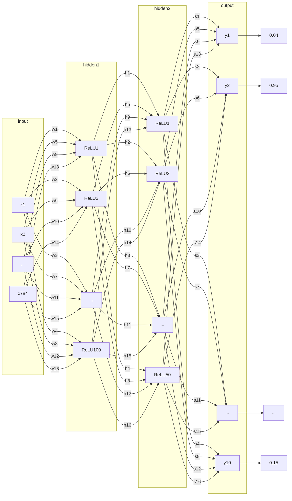

# Handwritten Numbers Classifier

This is my implementation to CSE477s course project using PyTorch.

## Downloading PyTorch

 - You will have to install `pip` first.

For CPU-only version:
```bash
pip install torch torchvision
```

For GPU version (assuming you have CUDA installed):
```bash
pip install torch torchvision torchaudio -f https://download.pytorch.org/whl/cu{CUDA_VERSION}/torch_stable.html
```

## Installing CUDA

```bash
sudo apt install nvidia-cuda-toolkit
```

## Datasets (Only CSV)

You can download it from [kaggle](https://www.kaggle.com/datasets/hojjatk/mnist-dataset) or the [official website](http://yann.lecun.com/exdb/mnist/index.html) and place it inside the root directory of the project.

Note that the `.pt` datasets are not supported here.

## Build Instructions (Linux only)

 - Clone the repository.
```bash
git clone https://github.com/k0T0z/handwritten-numbers-classifier.git
```
 - Change directory to the project's root directory.
```bash
cd handwritten-numbers-classifier
```
 - Install the dependencies.
```bash
chmod +x install.sh
```
```bash
./install.sh
```
 - Run the project.
```bash
python3 main.py
```

## Architecture



## Results

| CPU | Memory | GPU | OS |
| --- | --- | --- | --- |
| Intel® Core™ i7-8565U CPU @ 1.80GHz × 8 | 16.0 GiB | Mesa Intel® UHD Graphics 620 (WHL GT2) | Ubuntu Linux 64-bit |

### Architecture 1 - [code](https://github.com/k0T0z/handwritten-numbers-classifier/blob/master/convolution_and_dense_network_with_SGD_optimizer.ipynb)

| --- | Input | Number of kernels | Kernel | Stride | Padding | Activation function |
| --- | --- | --- | --- | --- | --- | --- |
| Conv1 | 1x28x28 | 6 | 3x3 | 1 | 1 | ReLU |
| Conv2 | 6x14x14 | 10 | 3x3 | 1 | 1 | ReLU |

| --- | Type | Kernel | Stride | Padding |
| --- | --- | --- | --- | --- |
| Pool1 | Max | 2x2 | 2 | 0 |
| Pool2 | Max | 2x2 | 2 | 0 |

| Optimizer | Learning rate | Loss function |
| --- | --- | --- |
| SGD | 0.01 | MSE |

| --- | Number of neurons | Activation function |
| --- | --- | --- |
| Input | 10x7x7 | - |
| Hidden1 | 100 | ReLU |
| Hidden2 | 50 | ReLU |
| Output | 10 | - |

| Epochs | Accuracy (%) | Loss (%) | time (s) |
| --- | --- | --- | --- |
| +5 | 95.49 | 1.1237384 | 102 |
| +5 | 97.16 | 0.7461372 | 106 |
| +5 | 97.72 | 0.5825789 | 99 |
| +5 | 97.99 | 0.4852823 | 103 |
| +5 | 98.27 | 0.4189607 | 104 |

### Architecture 2 - [code](https://github.com/k0T0z/handwritten-numbers-classifier/blob/master/convolution_and_dense_network_with_adam_optimizer.ipynb)

| --- | Input | Number of kernels | Kernel | Stride | Padding | Activation function |
| --- | --- | --- | --- | --- | --- | --- |
| Conv1 | 1x28x28 | 6 | 3x3 | 1 | 1 | ReLU |
| Conv2 | 6x14x14 | 10 | 3x3 | 1 | 1 | ReLU |

| --- | Type | Kernel | Stride | Padding |
| --- | --- | --- | --- | --- |
| Pool1 | Max | 2x2 | 2 | 0 |
| Pool2 | Max | 2x2 | 2 | 0 |

| Optimizer | Learning rate | Loss function |
| --- | --- | --- |
| Adam | 0.01 | MSE |

| --- | Number of neurons | Activation function |
| --- | --- | --- |
| Input | 10x7x7 | - |
| Hidden1 | 100 | ReLU |
| Hidden2 | 50 | ReLU |
| Output | 10 | - |

| Epochs | Accuracy (%) | Loss (%) | time (s) |
| --- | --- | --- | --- |
| - | - | - | - |

### Architecture 3 - [code](https://github.com/k0T0z/handwritten-numbers-classifier/blob/master/dense_network_with_SGD_optimizer.ipynb)

| Optimizer | Learning rate | Loss function |
| --- | --- | --- |
| SGD | 0.01 | MSE |

| --- | Number of neurons | Activation function |
| --- | --- | --- |
| Input | 28x28 | - |
| Hidden1 | 100 | ReLU |
| Hidden2 | 50 | ReLU |
| Output | 10 | - |

| Epochs | Accuracy (%) | Loss (%) | time (s) |
| --- | --- | --- | --- | --- |
| +50 | 97.60 | 0.5034259 | 460 |
| +50 | 97.84 | 0.3435347 | 465 |
| +50 | 97.91 | 0.2654962 | 457 |
| +50 | 97.90 | 0.2155851 | 463 |

### Architecture 4 - [code](https://github.com/k0T0z/handwritten-numbers-classifier/blob/master/dense_network_with_adam_optimizer.ipynb)

| Optimizer | Learning rate | Loss function |
| --- | --- | --- |
| Adam | 0.01 | MSE |

| --- | Number of neurons | Activation function |
| --- | --- | --- |
| Input | 28x28 | - |
| Hidden1 | 100 | ReLU |
| Hidden2 | 50 | ReLU |
| Output | 10 | - |

| Epochs | Accuracy (%) | Loss (%) | time (s) |
| --- | --- | --- | --- | --- |
| +1 | 89.69 | 1.8232597 | 18 |
| +1 | 88.21 | 1.8163300 | 15 |

### Architecture 5 - [code](https://github.com/k0T0z/handwritten-numbers-classifier/blob/master/dense_network_with_leaky_ReLU_activation.ipynb)

| Optimizer | Learning rate | Loss function |
| --- | --- | --- |
| SGD | 0.01 | MSE |

| --- | Number of neurons | Activation function |
| --- | --- | --- |
| Input | 28x28 | - |
| Hidden1 | 100 | Leaky ReLU |
| Hidden2 | 50 | Leaky ReLU |
| Output | 10 | - |

| Epochs | Accuracy (%) | Loss (%) | time (s) |
| --- | --- | --- | --- | --- |
| +50 | 97.19 | 0.5337998 | 463 |
| +50 | 97.52 | 0.3658192 | 443 |

### Architecture 6 - [code](https://github.com/k0T0z/handwritten-numbers-classifier/blob/master/dense_network_with_ELU_activation.ipynb)

| Optimizer | Learning rate | Loss function |
| --- | --- | --- |
| SGD | 0.01 | MSE |

| --- | Number of neurons | Activation function |
| --- | --- | --- |
| Input | 28x28 | - |
| Hidden1 | 100 | ELU |
| Hidden2 | 50 | ELU |
| Output | 10 | - |

| Epochs | Accuracy (%) | Loss (%) | time (s) |
| --- | --- | --- | --- | --- |
| - | - | - | - |


