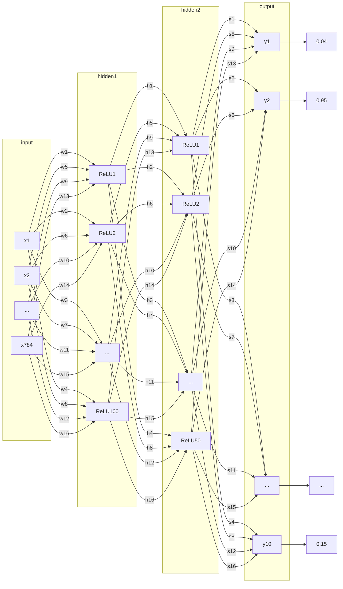

# Handwritten Numbers Classifier

This is my implementation to CSE477s course project using PyTorch.

## Downloading PyTorch

 - You will have to install `pip` first.

For CPU-only version:
```bash
pip install torch torchvision
```

For GPU version (assuming you have CUDA installed):
```bash
pip install torch torchvision torchaudio -f https://download.pytorch.org/whl/cu{CUDA_VERSION}/torch_stable.html
```

## Installing CUDA

```bash
sudo apt install nvidia-cuda-toolkit
```

## Datasets (Only CSV)

You can download it from [kaggle](https://www.kaggle.com/datasets/hojjatk/mnist-dataset) or the [official website](http://yann.lecun.com/exdb/mnist/index.html) and place it inside the root directory of the project.

Note that the `.pt` datasets are not supported here.

## Build Instructions (Linux only)

    - Clone the repository.
```bash
git clone https://github.com/k0T0z/handwritten-numbers-classifier.git
```
    - Change directory to the project's root directory.
```bash
cd handwritten-numbers-classifier
```
    - Install the dependencies.
```bash
chmod +x install.sh
```
```bash
./install.sh
```
    - Run the project.
```bash
python3 main.py
```

## Architecture



## Results

| Epochs | Accuracy | Loss |
| --- | --- | --- |
| +20 | 0.9775 | 0.003803798 |
| +20 | 0.9801 | 0.000000453 |
| +20 | 0.9799 | 0.000000215 |

As shown above it's enough to train the model for 40 epochs to get a good accuracy using the architecture used.


